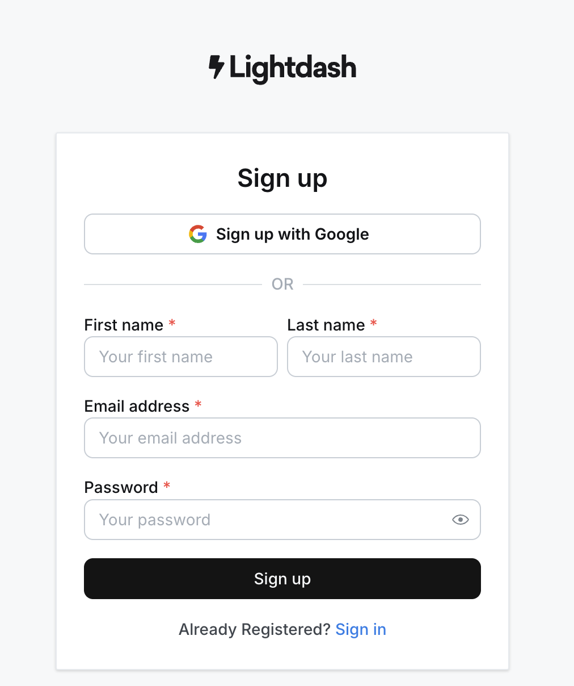
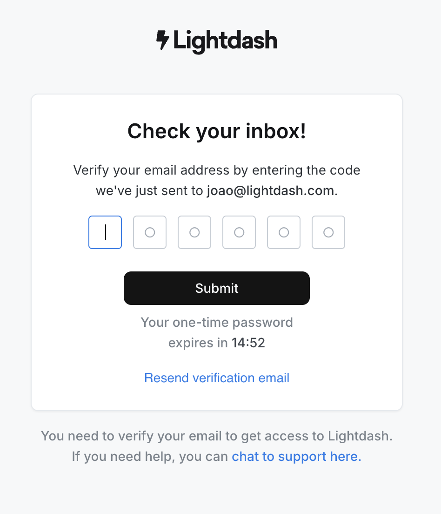
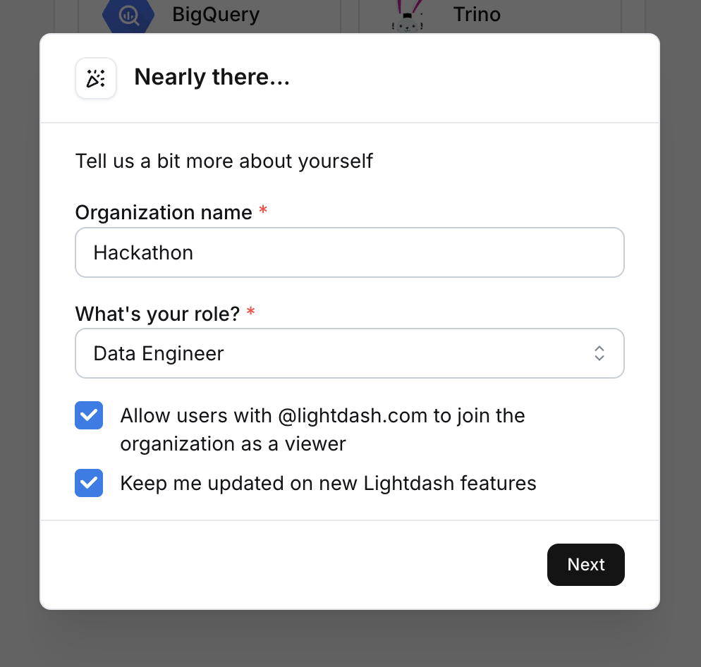
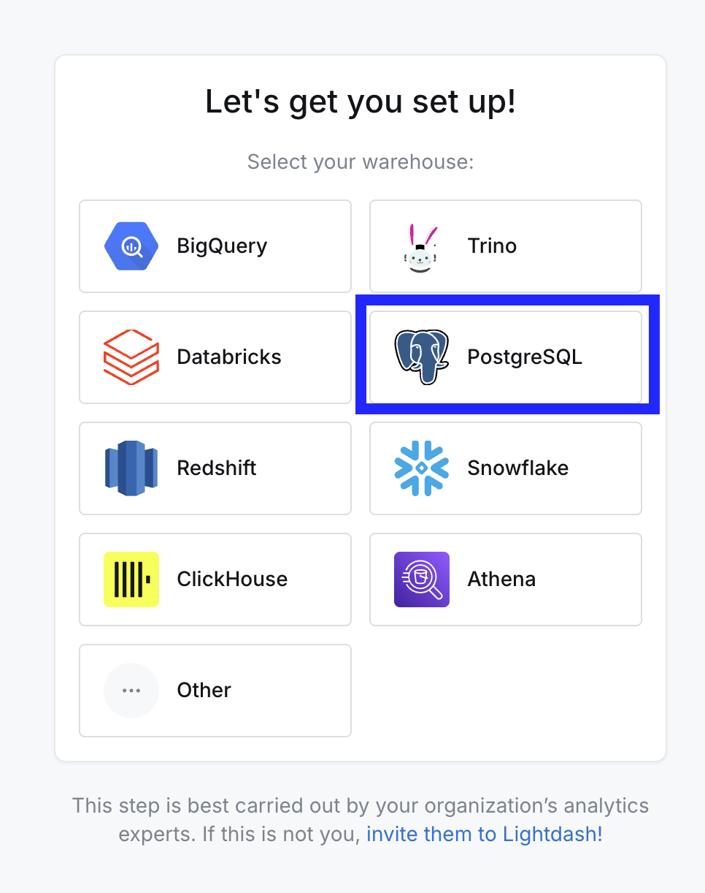
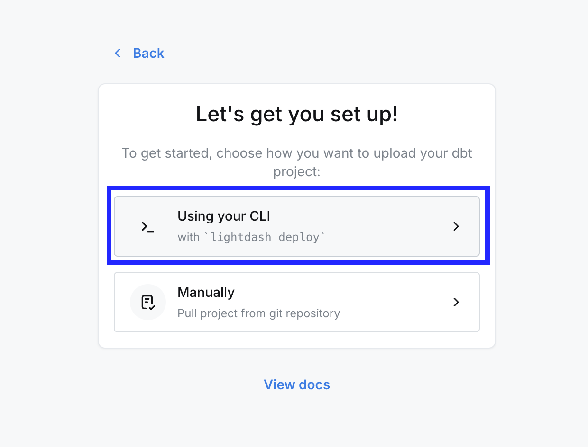
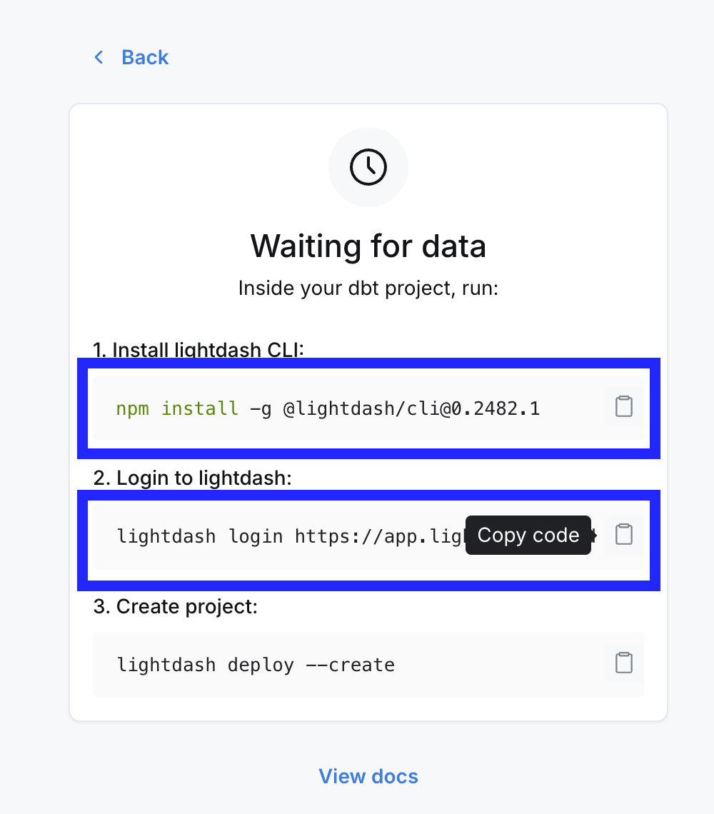
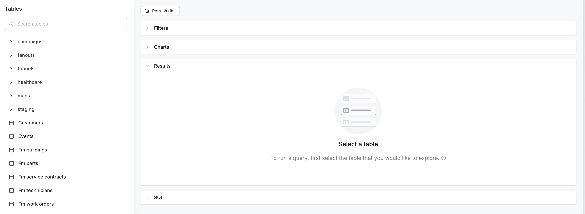

# Lightdash Demo — Quick Start

Get from zero to charts on your Supabase data in ~15 minutes. No dbt required.

Start by cloning this repo — it's your playground:

```bash
git clone git@github.com:lightdash/lightdash-supabase-quickstart.git
cd lightdash-supabase-quickstart
```

---

## Step 1 — Sign up at app.lightdash.cloud

Head to [app.lightdash.cloud](https://app.lightdash.cloud) and create a free account.



---

## Step 2 — Verify your email

Check your inbox for a verification code and enter it to confirm your account.



---

## Step 3 — Create your organization

Give your organization a name — this is just your workspace, you can always change it later.



---

## Step 4 — Select Postgres as your warehouse

When asked to pick a warehouse, choose **Postgres** (Supabase runs on Postgres under the hood).



---

## Step 5 — Choose "Using your CLI"

Select the **"Using your CLI"** option — this is the fastest way to get set up and what this project is built for.



---

## Step 6 — Install the CLI and log in

Copy the two commands shown on screen — one to install the Lightdash CLI and one to log in with your auth token.

> [!NOTE]
> You can skip the "deploy" command, we will do that later

> [!IMPORTANT]
> 💡 **Keep that login command saved!** It contains your personal auth token. If you ever need to re-login (new machine, new terminal session), just run it again.



```bash
npm install -g @lightdash/cli
lightdash login https://app.lightdash.cloud --token <your-token>
```

---

## Now let's get into the code

Before diving in, make sure you have these three things sorted:

### Prerequisite 1 — Install the Lightdash CLI

```bash
npm install -g @lightdash/cli
```

### Prerequisite 2 — Install Lightdash skills for your AI agent

This loads the Lightdash YAML schema into your AI session so it can generate and validate models correctly. Pick the command for your editor:

```bash
# Claude Code (default)
lightdash install-skills

# Cursor
lightdash install-skills --agent cursor

# Codex
lightdash install-skills --agent codex
```

### Prerequisite 3 — Connect the Supabase MCP

The Supabase MCP lets your AI agent query your database schema directly — no copy-pasting required. The config file is already included in this repo for both editors:

- **Cursor** — `.cursor/mcp.json` ✓
- **Claude Code** — `.claude/mcp.json` ✓

This works on **macOS, Linux, and Windows** — it's a remote HTTP connection, so there's nothing platform-specific to install.

#### Setup steps

1. **Open this project in Cursor** (or Claude Code). The editor will detect `.cursor/mcp.json` automatically.

2. **Authenticate** — Cursor will prompt you to log in. This opens a browser window where you sign in to your Supabase account and grant the MCP access to your organization.

   > [!NOTE]
   > No personal access token (PAT) is needed — authentication happens via browser login.

3. **Verify the connection** — In Cursor, go to **Settings → Cursor Settings → Tools & MCP**. You should see `supabase` listed with a green status indicator.

   If it shows as disconnected, click the refresh button or restart Cursor.

4. **Test it** — Ask the agent something like _"What tables are in my database? Use MCP tools."_ If it returns your tables, you're good to go.

#### Troubleshooting

| Problem | Fix |
|---|---|
| MCP shows "client closed" or keeps disconnecting | Restart Cursor. On Windows, also check that your firewall/antivirus isn't blocking outbound HTTPS |
| Auth popup doesn't appear | Open Cursor's command palette (`Ctrl+Shift+P` / `Cmd+Shift+P`) → "MCP: Sign in" or restart Cursor |
| Wrong organization/project | Re-authenticate — the browser login lets you pick which org to grant access to |
| Need to scope to a specific project | Add `?project_ref=your-project-ref` to the URL in `.cursor/mcp.json` |

> Want to customise the setup — scope to a specific project, disable write access, or use a PAT for CI? See the [Supabase MCP docs](https://supabase.com/docs/guides/getting-started/mcp).

---

### Connect your database

Run the setup script — it'll walk you through entering your Supabase credentials and test the connection:

```bash
# macOS / Linux
bash setup.sh

# Windows (PowerShell)
powershell -ExecutionPolicy Bypass -File ./setup.ps1
```

You'll find your connection details under **Supabase → Connect → Session Pooler → View parameters**.


---

### Generate models from your schema

Open this project in **Cursor** or **Claude Code** and ask the AI:

```
Look at my Supabase tables and generate Lightdash models
```

The agent will query your schema via the Supabase MCP (already configured in `.cursor/mcp.json` and `.mcp.json`) and create YAML files in `lightdash/models/` for each table — with sensible metrics and dimensions already wired up.

---

### Deploy your project and connect your warehouse

Always lint before deploying to catch any issues early:

```bash
lightdash lint
lightdash deploy --create --no-warehouse-credentials
```

Then connect your warehouse — this script does it in one shot using the credentials from your `.env`:

This script uses the API to set the warehouse credentials on your project — no UI step needed.

```bash
# macOS / Linux
bash set-warehouse.sh

# Windows (PowerShell)
powershell -ExecutionPolicy Bypass -File ./set-warehouse.ps1
```

---

### You can now query your data in Lightdash

Now that your warehouse is connected, you can start building charts and dashboards in Lightdash at https://app.lightdash.cloud/projects/YOUR-PROJECT-UUID/tables



### After any model changes

```bash
lightdash lint && lightdash deploy --no-warehouse-credentials
```

---

### After any chart or dashboard changes

```bash
lightdash upload --include-charts
```
